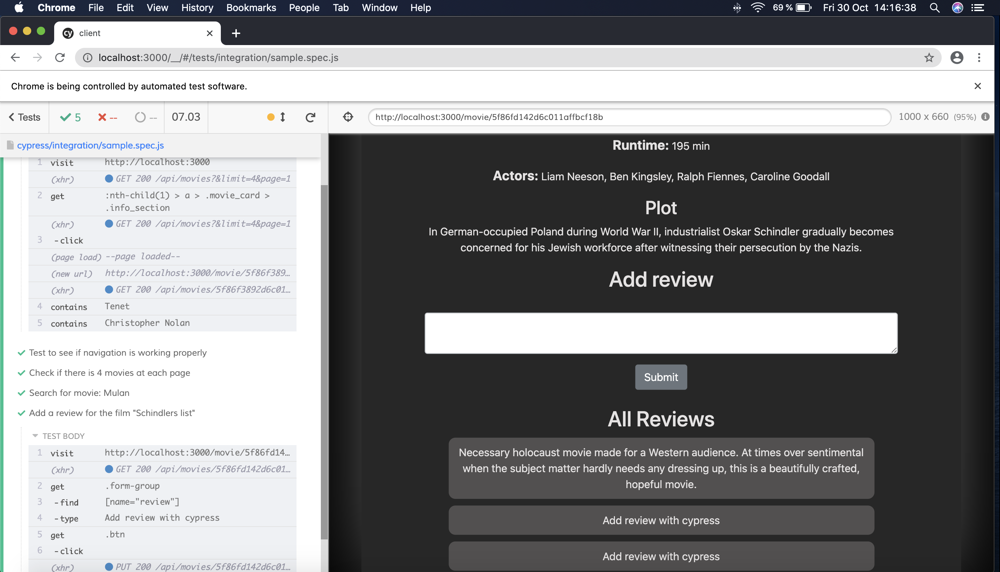

# Project 3 - IT2810 Group 32

# Kort om prosjektet
Prosjektet er en moviedb laget på MERN og typescript. Redux brukt som state management.

# How to run locally

1. Connect to NTNU network (if you aren't there physically, use a VPN. Instructions: https://innsida.ntnu.no/wiki/-/wiki/English/Install+VPN)
2. Open two terminals
3. Navigate to the "project-3-it2810-group-32" folder.
3.  In terminal 1:
   cd server -> npm install -> npm start
5. In terminal 2:
   cd client -> npm install -> npm start

Sometimes the server needs to be stopped (ctr+c) and run again (npm start)

Client is running on localhost:3000 and server is running on localhost:5000

# How to run on gitpod

In gitpod everthing should set up automatically - but there are some issues with ports and access so it is better to clone and run locally. 
If you need to start the project again go to the root folder and run npm start

Client is running on localhost:3000 and server is running on localhost:5000

## If gitpod doesn't work

Clone and run locally.

# Overview

This project consists of a client part and a server part

# Client

## Technologies

The client is build on typescript, redux, bootstrap/reactstrap, react-router and axios.

## State management

State management is done by usage of both redux and react hooks.
Redux is used for handling the state of movies and pagination. For movies the states that are handled are an array
of all movies we currently are showing the user.

For states limited to local files we have used react hooks to simplify the program and to avoid
passing states around that are not necessary to keep in a global store.

## Content and functionality

1. Search - the user can do a search on movie titles. The search will query the backend via the API and the backend
   returns the matches.
2. Presentation of movies with pagination to prepare for handling of a large dataset and increase readability for the user.
   This is also done by using the API and the back-end.
3. By clicking on a movie more information of that movie is shown. This is done by querying for the specific movie ID in the database via the API.
4. Sorting and filtering - the user can sort all the movies by year, ascending or descending. The user can filter by up to three genres that are cumulative filtered. The filtering and sorting are also
   cumulative, as well as the search so if the user have entered a search in the search bar, a filter and a sorting all the data is sent to the api and handled backend.
5. User generated data that is saved to the backend. If a movie is added as a favorite, this choice is saved in the
   database (Clicking the little heart symbol on the front page will turn it red and save it as a favorite).
   The user can add also reviews to every movie which are saved to the database. There is no user-specific functionality
   in place so all reviews are anonymous.
6. Database is hosted on the virtual machine using MongoDB and contains a total of 20 movies.

# Server

## REST API

The server side is implemented using typescript, mongoDB and express.
A REST api is setup with a base url of /api/movies and have the following
functions

### Get requests

1. /api/movies/<id> => return a single movie if the id exist, else an error.
2. /api/movies
   If no options are added returns a json object with key totalCount and data-array
   where the movies objects are in the data-array
   Options can be added using regular syntax, ie /api/movies?title=Tenet&sortByYear=ascending
   Available options:
   title - filter title by partial match ignoring case
   year - filter year by partial match ignoring case
   sortByYear - can either be sortByYear=descending or ascending. Sorts by year
   genre - input as an array, ie ?genre[]=action&genre[]=drama - filter by all categories
   page - what page to show
   limit - how many results to return

### Put requests

1. /api/movies/<id> - creates a new movie object based on json data sent and
   updates an existing movie. Used to write comments and favorite movies to db.

## GraphQL

We decided not to implement GraphQL after learning about both REST API and GraphQL
since REST API was easier to implement and gave us all the functionality we needed
for this project.

GraphQL would be better suited for a bigger project where we had a lot more data to fetch.
Using GraphQL we would be able to fetch certain parts of the stored data, while with
REST we need to fetch the entire document and choose what we want in the front-end.

## Testing

For automatic end-2-end testing, we have used the cypress (https://www.cypress.io/) library
and made 5 tests that test different functionalities and navigation in the app.

We wanted to use the cypress framework cypress-react-unit-test to make unit tests, but we could not make it work as several errors was generated during this.
We then tried other alternatives such as ensyme and jest, but it was hard making it work with typescript. The different tests we have made with cypress,
in our opinion, can be regarded as unit tests since they test do test the functionality of the app. An example would be that the last test successfully enters a review on the movie "Schindler's list"

**RUN CYPRESS TEST**

1. Open new terminal in client
2. Type  "npm run e2e"
3. A window with cypress should open up
4. press "run all tests" in upright corner

If the above don't work:

1. Clone the repo
2. Open a terminal in client
3. Type "npm run e2e"
4. 3. A window with cypress should open up
5. press "run all tests" in upright corner

For some reason GitPod and Cypress don't work well together. The second solution will work, but requires a bit more work.
Here is a screenshot taken 30.10.2020 14:16:38, to prove that it works when running it locally if you don't want to clone the repo:

The fifth test checks if a user is able to add a review to a movie, but this will add a new review every time the test is run.
It is easy to remove these reviews after being implemented by running the mongodb query "cy.exec('db.movies.update( {Reviews: "This is a test"}, {\$unset: {Reviews: ""}})')",
but we wasn't able to implement this when running the test in cypress. Another work-around for deleting an review after each test run is to add a button to a review
which takes a movie-object, remove a comment/review and send it to an existing function called "updateMovie". We decided to not implement this last option
because we did not want a user to be able to delete another users review. Since we did not implement authorization for this kind of functionality, the result was
to just have every test add the same review every time it runs.

If you want to inspect the code, these tests are placed under client/cypress/integration/sample.spec.js.

We also attempted to make both Snapshot tests and Unit tests using the Enzyme library, as well as react-redux in order to test with our existing framework. 
Enzyme would primarily have allowed us to create "shallow" tests, where for example a snapshot would not need access to the entire tree to pass the test.
We also tried using redux-mock-store, which would have allowed us to create a mock store to use with our connected components to create unit tests. 
We did however not manage to use these frameworks in a good enough way, so we ended up dropping this idea. using react-redux would also have allowed us
to test specific Redux components like action or reducers.

# Git

We have used git actively and have used issues as a todo-list where we have assigned issues to ourselves
and to team-members. This is to keep control of what everyone is doing and what is missing. We have used branches to ensure that the code which is implemented
is thoroughly tested and working, before merging it to the master branch. By doing this the latest version (the master branch) will always function.
We have also made a link between the commits and the issues by referring to the issue by #<number>. In hindsight we realise that we could have used issues more frequently
and for smaller things that needed fixing, but it still worked well for our use case.
